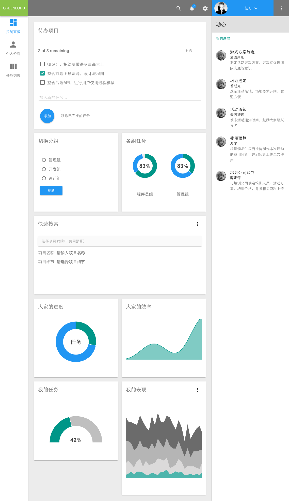

# Angular Material Control Panel Design for Greenlord

[Angular Material](https://github.com/angular/material).

Check out [DEMO](#)

## Getting started

Clone project:

    $ git clone https://github.com/YolandaYang/greenlord-angular-material.git

Install dependencies:

    $ npm install

Install gem 'sass'

    $ gem install sass
    
Run development web-server:

    $ gulp serve

## Features

* AngularJS
* Angular UI Router
* Angular Material
* Sass styles
* Gulp build
* Stylish, clean, responsive layout with original design
* BrowserSync for the ease of development

## Project structure and credits

Project structure based on [gulp-angular yeoman generator](https://github.com/Swiip/generator-gulp-angular) and [flatlogic angular material dashboard](http://flatlogic.github.io/angular-material-dashboard/site/)

UI components built with [Angular Material](https://material.angularjs.org/).